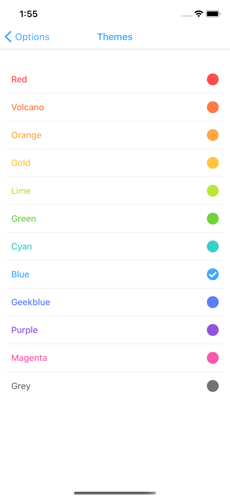

# Currency Converter (react-native)

## How to run
- Install nodejs
- Install react-native globally (npm i -g react-native)
- Install XCode or Android Studio
- cd appFolder
- npm i
- npm run ios or npm i android

This project contains react-native application to convert currencies with following features:

## Screens:

### Splash Screen

This page is shown for a very short duration before loading app state like saved auth state, theme, favorite currencies.

### Login
This screen contains username and password inputs and a button. When login button is pressed, credentials are matched and if valid credentials are provided, it will navigate to Home screen. 
Credentials:
username: Admin
password: Admin

### Home
Home screen contains an animated logo showing base currency and target currency and two currency fields.
Writing in one input, 2nd input shows converted value for target currency. User can switch base and target currencies either by clicking on animated logo icon or a conversion icon between two inputs. Every input field has a addon which shows selecetd currency. On clicking/toching addOn, Currencies List screen is shown.

### Currencies List
Currencies List screen contains all currencies supported by the currency api to fetch currencies exchange rates. 
Api url: https://api.exchangeratesapi.io 

### Themes
Themes screen contains a FlatList which shows Theme item which contains name and color in every row. On clicking color circle/icon, app theme gets changed and applied all over app.

*Red*

*Volcano*

*Orange*

*Gold*

*Lime*

*Green*

*Cyan*

*Blue*

*Geekblue*

*Purple*

*Magenta*

*Grey*

### Options
This screen contains links to other pages in app like Themes, Favorties, an external link to Api being used for currency conversion and logout button which removes auth state and moves users to Login screen.

### Favorites
This page contains user's favorite currencies which user can mark favorite from Currency List screen.

## Testing & Code Coverage
This is a work in progress.
